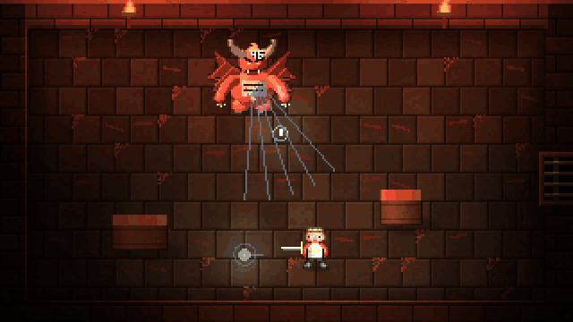
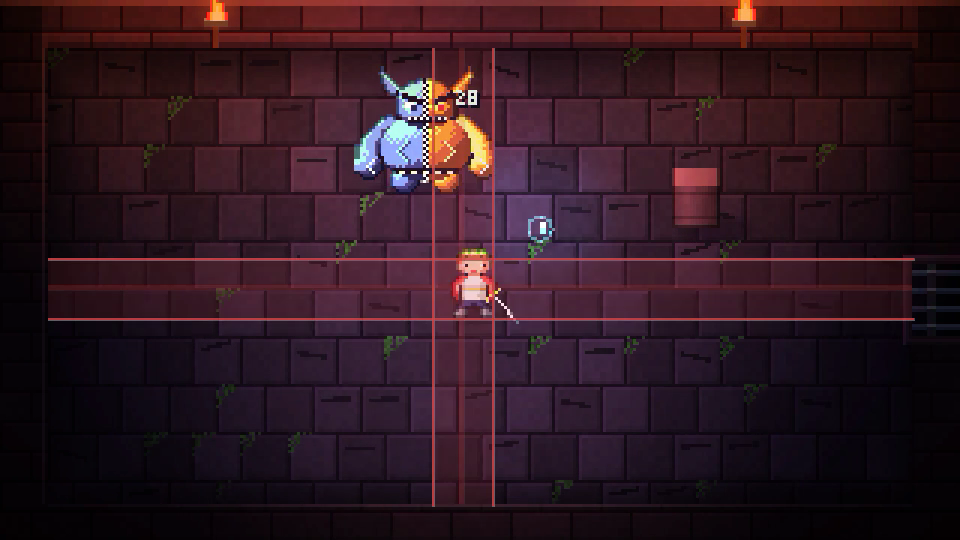
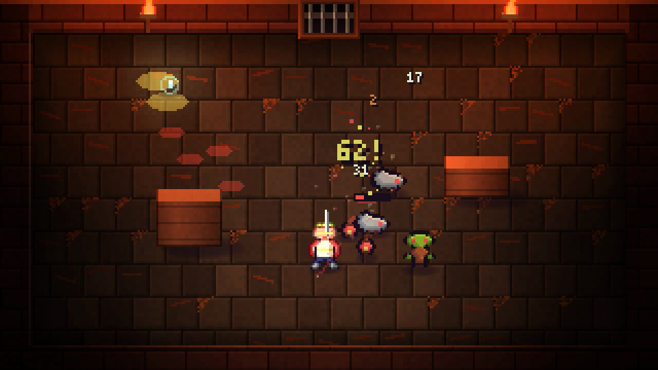
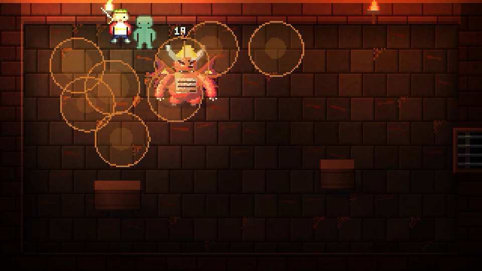

# Clauwler

**A real-time pixel-art roguelike that lives in a Claude Code pane, and feeds on your session.**

Claude works, you fight. Every failed command crawls out of a rift as a monster named after its error. Every commit seals a relic. Green tests heal you, subagents fight at your side, and a compacted context shakes the whole dungeon.

<p align="center">
  
</p>

<p align="center">
  
  
</p>

## What your session does to the dungeon

| In Claude Code | In Clauwler |
| --- | --- |
| A command fails | A rift opens and the error crawls out as a named elite. Kill it for XP. |
| Tests pass | You heal, gain shards, and a chest appears. |
| A commit | A seal. Three seals forge a relic you keep across runs. |
| Claude reads files | You heal a little. |
| Claude edits a file | A rune is carved. |
| A subagent starts | A familiar joins the fight. |
| A web search | A boon portal opens. |
| The context is compacted | A quake crushes every foe in the room. |
| A long turn | A *Session Echo* room appears on the map. |
| Claude finishes its turn | Your power recharges. |

Your real mistakes never cost you anything: the session only provides content, the game decides.

## The game

- **Real time, Isaac and Hades style.** Rooms lock until they are cleared, then a map of the floor opens. There are 3 floors, each ending with a guardian.
- **Builds.** There are 8 gods of the repo: Grep, Sudo, Fork, Rebase, Lint, Cache, Commit and Pipe. Their boons fill your attack, power, cast and passive slots, and two gods together grant duo boons. Add 29 items, 4 weapons (sword, spear, bow, shield) and aspects.
- **One champion per git repo.** Their class comes from the repo's stack: Rust makes a Smith, Python an Alchemist, TypeScript an Illusionist, and so on. A **lineage** is shared across all your repos, with its vault of relics, its chronicle and its nemeses. Each **branch** keeps its own camp and run.
- **Few keys.** You move and the champion attacks the nearest foe on their own. `E` dodges, `R` casts.

<p align="center">
  
</p>

## Install

You need:

- **Claude Code** with function hooks turned on (`CLAUDE_CODE_ENABLE_FUNCTION_HOOKS=1`).
- **A terminal that draws images:** [Ghostty](https://ghostty.org), Kitty or WezTerm. Other terminals get a block-character mode.
- **Node 18+** on your `PATH`. A small picture process draws the frames at 30 fps outside Claude Code. Without Node, the mod draws them itself, more slowly.

### From the marketplace

```sh
claude plugin marketplace add meffysto/clauwler
claude plugin install clauwler@clauwler
```

### Or from a clone

```sh
git clone https://github.com/meffysto/clauwler ~/clauwler
claude --plugin-dir ~/clauwler
```

To load it in every session, add both variables to the `env` block of `~/.claude/settings.json`:

```json
{
  "env": {
    "CLAUDE_CODE_ENABLE_FUNCTION_HOOKS": "1",
    "CLAUDE_CODE_PLUGIN_DIRS": "~/clauwler"
  }
}
```

Then type **`/clauwler`** in Claude Code.

## Controls

| Key | Action |
| --- | --- |
| `W A S D` (or `Z Q S D`) | Move. The champion attacks on their own. |
| `E` | Dodge |
| `R` | Cast your power |
| `P` | Pause: map, log, build |
| `H` | Go back to camp |
| `X` | Sound on or off |
| `V` | Picture rate: 30, 24 or 15 fps |
| `L` | Language, English or French (outside a run) |

The language follows your system locale. The pane needs focus to read keys: Claude Code shows how to focus it when it doesn't have focus.

## How it works

Clauwler is a single Claude Code mod: `hooks/register.tsx` registers the hooks.

- **The simulation** (`hooks/sim.ts`) runs at 30 ticks a second in the mod.
- **The session link** (`hooks/session.ts`) turns `tool.call`, `turn.complete` and `session.compact` events into dungeon events.
- **The renderer** (`hooks/render.ts`, `hooks/art.ts`) draws a 320×180 frame with Scale2x sprites, a cached static layer and per-cell lighting. It runs in a Node process (`helper/`) that reads the room from a file, encodes an indexed PNG (`hooks/png.ts`) and hands the path back. The terminal reads the picture directly, so no pixel crosses Claude Code.
- **Saves** go to the mod's store: one champion per repo, one camp per branch, one lineage for everything.

## Developing

```sh
claude plugin test .        # 51 tests: combat, builds, session, pane, i18n, perf, balance
tools/build-helper.sh       # rebuild helper/engine.mjs after editing render, png, art or sim
tools/film.sh out.mp4 74 75 # film the bot playing seed 74 for 75 s, 1080p
tools/bench.sh              # play headless under a fake Ghostty (CLAUWLER_PERF=1 logs to .perf/)
```

For hot reloading, point `CLAUDE_CODE_PLUGIN_DIRS` at your clone: saving a file reloads the mod in the running session.

## License

MIT
